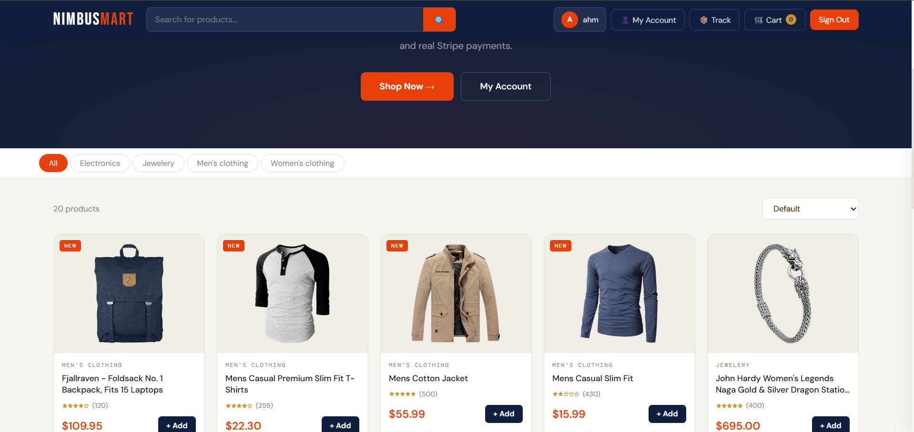
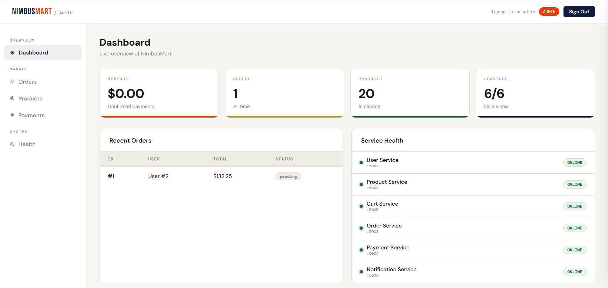

<a id="readme-top"></a>

[![License][license-shield]](#license)

<div align="center">
  <h1 align="center">CloudCommerce</h1>
  <p align="center">
    A production-style, Docker-based microservices e-commerce platform built with Flask, PostgreSQL, Redis, Nginx, Stripe, Firebase Realtime Database, Cloudinary, and Resend.
    <br />
    <a href="#getting-started"><strong>Explore the setup docs »</strong></a>
    &nbsp;·&nbsp;
    <a href="https://github.com/Malik-Ahmed-Abdullah/cloud-commerce/issues">Report Bug</a>
    &nbsp;·&nbsp;
    <a href="https://github.com/Malik-Ahmed-Abdullah/cloud-commerce/issues">Request Feature</a>
  </p>
</div>

---

## Table of Contents

- [About The Project](#about-the-project)
- [Architecture](#architecture)
- [Screenshots](#screenshots)
- [Built With](#built-with)
- [Getting Started](#getting-started)
  - [Prerequisites](#prerequisites)
  - [Installation](#installation)
  - [Environment Variables](#environment-variables)
- [Usage](#usage)
- [Service Reference](#service-reference)
- [Roadmap](#roadmap)
- [Contributing](#contributing)
- [License](#license)
- [Contact](#contact)
- [Acknowledgments](#acknowledgments)

---

## About The Project

CloudCommerce is a full-stack e-commerce demo built as a set of independently deployable microservices rather than a monolith. Each service owns its own responsibility — user auth, product catalogue, cart, orders, payments, and notifications — and communicates over HTTP through an Nginx reverse proxy.

Key features include:

- **Real Stripe payments** via Payment Intents with webhook confirmation
- **Live order tracking** mirrored to Firebase Realtime Database, polling every 3 seconds in the browser with no page refresh
- **Persistent login** via JWT stored in `localStorage`, restored automatically on page load
- **Role-based access** — customers and admins have completely separate login flows; the admin dashboard is inaccessible to regular users
- **Account page** with full order history, stats, and one-click tracking per order
- **Product image uploads** via Cloudinary CDN
- **Order confirmation emails** via Resend
- **Redis-backed cart** shared across sessions
- **Admin dashboard** with live service health monitoring, order management, product management, and payment logs

The project is structured to run locally with a single `docker compose up --build` while reflecting the service boundaries, environment variable patterns, and external integrations expected in a production deployment.

<p align="right">(<a href="#readme-top">back to top</a>)</p>

---

## Architecture

```
                        ┌─────────────────────────────────┐
                        │         Browser / Client         │
                        └────────────────┬────────────────┘
                                         │ HTTP
                        ┌────────────────▼────────────────┐
                        │         Nginx (port 80)          │
                        │      Reverse Proxy + Static      │
                        └──┬──────┬──────┬──────┬─────┬───┘
                           │      │      │      │     │
               ┌───────────▼─┐ ┌──▼───┐ ┌▼───┐ │  ┌──▼──────────┐
               │ user-service│ │prod  │ │cart│ │  │order-service│
               │   :5001     │ │:5002 │ │:5005│ │  │   :5003     │
               └──────┬──────┘ └──┬───┘ └─┬──┘ │  └──────┬──────┘
                      │           │        │    │         │
               ┌──────▼───────────▼────────▼──┐ │  ┌──────▼──────────────┐
               │        PostgreSQL (RDS)        │ │  │  payment-service    │
               │         :5432                 │ │  │      :5004          │
               └───────────────────────────────┘ │  └──────┬──────────────┘
                                                  │         │
               ┌──────────────────────────────────┘  ┌──────▼──────────────┐
               │      notification-service            │       Stripe        │
               │           :5008                      │   Payment Intents   │
               └──────────────────────────────────────└─────────────────────┘
                          │
               ┌──────────▼──────────────────────────────────────┐
               │   Redis (ElastiCache)   Firebase Realtime DB     │
               │       :6379             (Live order tracking)    │
               └─────────────────────────────────────────────────┘
```

Each microservice is independently built and deployed as a Docker container. They share a single PostgreSQL database and a single Redis instance, both of which are externalised as managed services (AWS RDS and ElastiCache) in production.

<p align="right">(<a href="#readme-top">back to top</a>)</p>

---

## Screenshots

**Storefront**



**Admin Dashboard**



<p align="right">(<a href="#readme-top">back to top</a>)</p>

---

## Built With

| Layer | Technology |
|---|---|
| Backend services | [Flask](https://flask.palletsprojects.com/) |
| Database | [PostgreSQL 15](https://www.postgresql.org/) |
| Cache / Cart | [Redis 7](https://redis.io/) |
| Reverse proxy | [Nginx](https://nginx.org/) |
| Payments | [Stripe](https://stripe.com/) |
| Live order tracking | [Firebase Realtime Database](https://firebase.google.com/products/realtime-database) |
| Image uploads | [Cloudinary](https://cloudinary.com/) |
| Transactional email | [Resend](https://resend.com/) |
| Containerisation | [Docker](https://www.docker.com/) & Docker Compose |

<p align="right">(<a href="#readme-top">back to top</a>)</p>

---

## Getting Started

### Prerequisites

- [Docker](https://docs.docker.com/get-docker/) and Docker Compose
- A [Stripe](https://stripe.com/) account — test mode keys and a webhook secret
- A [Firebase](https://firebase.google.com/) project with Realtime Database enabled and a service account key JSON file
- A [Resend](https://resend.com/) account for outbound email
- A [Cloudinary](https://cloudinary.com/) account for image uploads

### Installation

1. Clone the repository:

   ```bash
   git clone https://github.com/Malik-Ahmed-Abdullah/cloud-commerce.git
   cd cloud-commerce
   ```

2. Copy the example environment file and fill in your credentials:

   ```bash
   cp .env.example .env
   ```

3. Place your Firebase service account key in the project root:

   ```
   cloudcommerce/
   └── firebase-key.json   ← downloaded from Firebase Console → Project Settings → Service Accounts
   ```

4. Start the full stack:

   ```bash
   docker compose up --build
   ```

5. Open the app:

   - **Storefront:** [http://localhost](http://localhost)

The stack will create the default admin account on first boot using the `ADMIN_USERNAME`, `ADMIN_EMAIL`, and `ADMIN_PASSWORD` values from your `.env` file. Use those credentials on the Admin Dashboard login screen.

### Environment Variables

Copy `.env.example` to `.env` and fill in all values before running.

| Variable | Description |
|---|---|
| `POSTGRES_DB` | PostgreSQL database name |
| `POSTGRES_USER` | PostgreSQL username |
| `POSTGRES_PASSWORD` | PostgreSQL password |
| `SECRET_KEY` | JWT signing secret — use a long random string |
| `STRIPE_SECRET_KEY` | Stripe secret key (`sk_test_...`) |
| `STRIPE_WEBHOOK_SECRET` | Stripe webhook signing secret (`whsec_...`) |
| `FIREBASE_DB_URL` | Firebase Realtime Database URL |
| `RESEND_API_KEY` | Resend API key (`re_...`) |
| `CLOUDINARY_CLOUD_NAME` | Cloudinary cloud name |
| `CLOUDINARY_API_KEY` | Cloudinary API key |
| `CLOUDINARY_API_SECRET` | Cloudinary API secret |
| `ADMIN_USERNAME` | Username for the default admin account |
| `ADMIN_EMAIL` | Email for the default admin account |
| `ADMIN_PASSWORD` | Password for the default admin account |

> **Never commit `.env` or `firebase-key.json` to version control.** Both are listed in `.gitignore`.

<p align="right">(<a href="#readme-top">back to top</a>)</p>

---

## Usage

### Customer flow

1. Register an account or sign in — the session persists across refreshes via JWT in `localStorage`
2. Browse the product catalogue, filter by category, and add items to your Redis-backed cart
3. Proceed to checkout and complete payment with a Stripe test card (`4242 4242 4242 4242`)
4. Receive an order confirmation email via Resend
5. Track your order live on the **Track Order** page or from **My Account → My Orders**

### Admin flow

1. Click **Admin Dashboard Login** on the sign-in screen — regular customer accounts cannot access this portal
2. Default credentials are set via `ADMIN_USERNAME` and `ADMIN_PASSWORD` in `.env`
3. Manage products (add, view, upload images via Cloudinary), update order statuses, review Stripe transactions, and monitor live service health

### Live order tracking

When an admin updates an order status in the dashboard, the change is written to Firebase Realtime Database. The customer's tracking page polls Firebase every 3 seconds and updates the progress bar and status icon in real time without a page refresh.

### Stripe webhook

For payment confirmation to work correctly, point a Stripe webhook at:

```
http://YOUR_HOST/payments/webhook
```

Subscribe to the `payment_intent.succeeded` event. Copy the signing secret into `STRIPE_WEBHOOK_SECRET` in `.env`.

<p align="right">(<a href="#readme-top">back to top</a>)</p>

---

## Service Reference

| Service | Container | Port | Responsibility |
|---|---|---|---|
| Nginx + Frontend | `frontend` | `80` | Static files, reverse proxy to all services |
| User Service | `user-service` | `5001` | Registration, login, JWT auth, role management |
| Product Service | `product-service` | `5002` | Product CRUD, categories, Cloudinary uploads, Redis cache |
| Order Service | `order-service` | `5003` | Checkout, order history, Firebase status sync |
| Payment Service | `payment-service` | `5004` | Stripe Payment Intents, webhook handling |
| Cart Service | `cart-service` | `5005` | Redis-backed cart per user |
| Notification Service | `notification-service` | `5008` | Order confirmation emails via Resend |
| PostgreSQL | `cloudcommerce-db` | `5432` | Persistent storage for users, products, orders, payments |
| Redis | `cloudcommerce-redis` | `6379` | Cart data, product category cache |

All services expose a `/health` endpoint returning `200 OK` when running. The admin dashboard polls these endpoints and displays live status.

<p align="right">(<a href="#readme-top">back to top</a>)</p>

---

## Roadmap

- [x] Microservices architecture with Docker Compose
- [x] Stripe payment integration with webhook confirmation
- [x] Firebase live order tracking
- [x] Persistent JWT login with role-based access control
- [x] Account page with order history and stats
- [x] Cloudinary product image uploads
- [x] Resend transactional email
- [x] Admin dashboard with health monitoring
- [ ] AWS deployment with Application Load Balancer across two EC2 instances
- [ ] Automated tests for Flask services
- [ ] CI/CD pipeline

<p align="right">(<a href="#readme-top">back to top</a>)</p>

---

## Contributing

Contributions are welcome. If you have a suggestion that would improve the project, fork the repo and open a pull request, or open an issue with the `enhancement` label.

1. Fork the project
2. Create your feature branch: `git checkout -b feature/your-feature`
3. Commit your changes: `git commit -m 'Add your feature'`
4. Push to the branch: `git push origin feature/your-feature`
5. Open a pull request

<p align="right">(<a href="#readme-top">back to top</a>)</p>

---

## License

No license has been added yet. If you plan to publish this publicly, add one before accepting external contributions. See [choosealicense.com](https://choosealicense.com) for options.

<p align="right">(<a href="#readme-top">back to top</a>)</p>

---

## Acknowledgments

- [Flask Documentation](https://flask.palletsprojects.com/)
- [Docker Documentation](https://docs.docker.com)
- [Stripe Documentation](https://docs.stripe.com)
- [Firebase Documentation](https://firebase.google.com/docs)
- [Cloudinary Documentation](https://cloudinary.com/documentation)
- [Resend Documentation](https://resend.com/docs)
- [Choose an Open Source License](https://choosealicense.com)
- [Shields.io](https://shields.io)

<p align="right">(<a href="#readme-top">back to top</a>)</p>

[license-shield]: https://img.shields.io/github/license/Malik-Ahmed-Abdullah/cloud-commerce.svg?style=for-the-badge